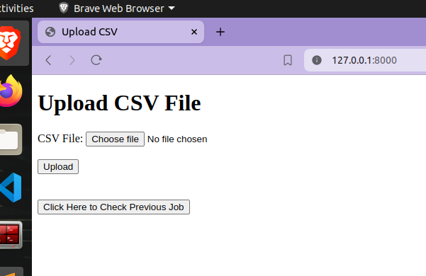
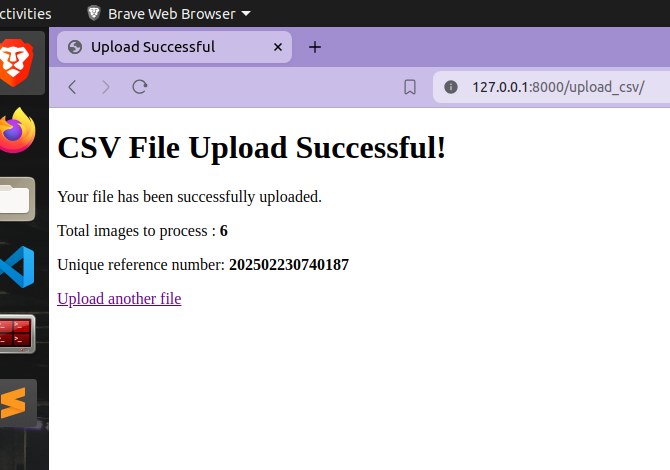
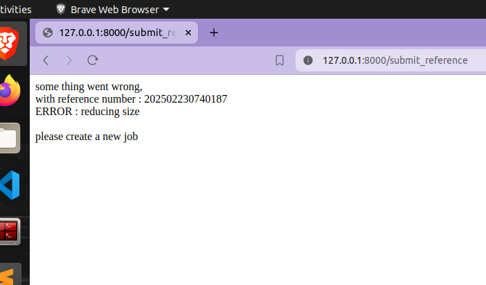
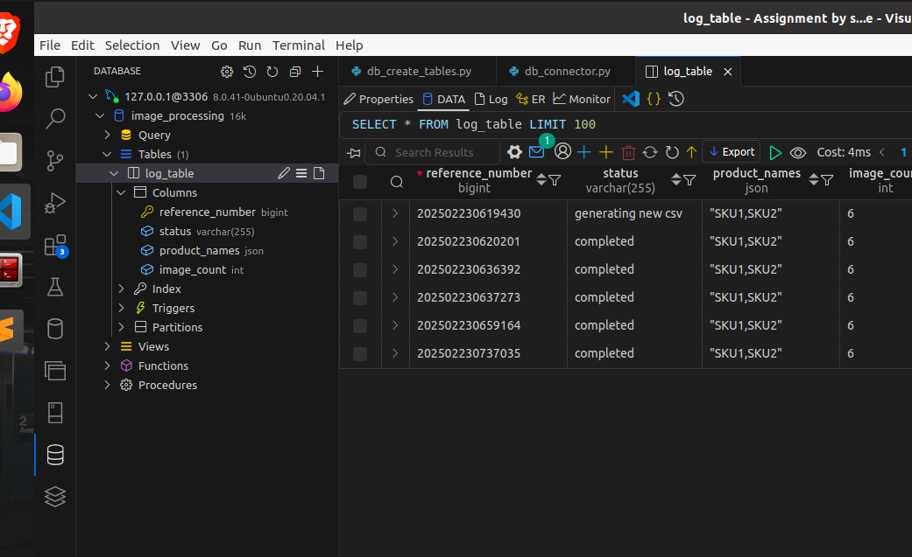

# Image Processing

Reduce image size by 50% (tested on image of 20kb which reduced to 7kb)

**Tech Stack**: FastAPI, SQLAlchemy, Pillow

## Setup

- `python -m venv env`
- `source env/bin/activate`
- `pip install -r requirements.txt`
- `pip install sqlalchemy mysqlclient fastapi`
- `sudo mysql -u root -p`
    - database should have a user: "user", with password: "pass"
    - create a database named "image_processing"

## Execution

- `uvicorn app:app --reload`
- Go to page "http://127.0.0.1:8000/"

## Flow

- Uploaded CSV gets saved in local folder (`data/in_csv_files`).
- CSV goes through a check for a few conditions, all failed conditions are shown to the user. If not failed, then flow continues.
- A new reference number is generated based on the total number of entries till now and timestamp.
- This reference number is sent to the user and a new async job is created with this reference ID.
- Database also gets logged with this new reference number.
- **Job**:
    - All images get downloaded to the local folder (`data/raw_images`).
    - To be unique, image name is coded with reference number + serial number + product name + image sequence number.
    - All images are reduced one by one using Pillow (50% in height and width).
    - A new CSV is created with this data.
- At every step of the job, the database gets updated (status field).
- When the user comes back for new images, the same reference number is used.
- If the job status is done successfully, the user can download the new updated CSV. If there is any error, it is displayed while checking the job status.
- Job status can be fetched at any time, as it is updated after every step.

## Directory Tree

<pre>
dir-tree ->
	├── app.py
	├── data
	│             ├── in_csv_files
	│             │             ├── 202502230413203.csv
	│             ├── out_cvs_files
	│             │             ├── 202502230413203.csv
	│             ├── processed_images
	│             │             ├── 202502230417272>1.>SKU1>0.jpg
	│             │             ├── 202502230417272>1.>SKU1>1.jpg
	│             └── raw_images
	│                 ├── 202502230417272>1.>SKU1>0.jpg
	│                 ├── 202502230417272>1.>SKU1>1.jpg
	│                 
	├── dummy_input_file.csv
	├── html_templates
	│             ├── check_status.html
	│             ├── csv_error.html
	│             ├── requirements.txt
	│             ├── upload_form.html
	│             └── upload_success.html
	├── readme.md
	├── requirements.txt
	└── scripts
	    ├── csv_sanitary_check.py
	    ├── db_connector.py
	    ├── db_create_tables.py
	    ├── db_models.py
	    ├── db_operations.py
	    ├── download_images.py
	    ├── generate_out_csv.py
	    ├── process_images.py

</pre>

## Screenshots

  
Upload page  

  
Successfully uploaded and job started in async  

  
If there is any error in CSV, or job steps, then the issue is displayed  

  
Database (MySQL)